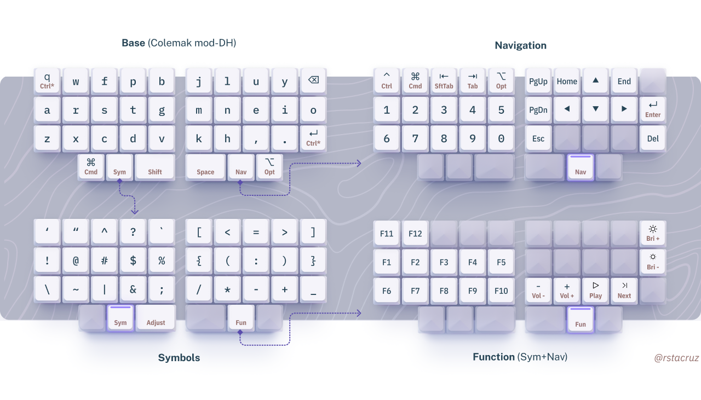

# my zmk config

Builds and flashes zmk firmware via Docker.



## Usage

```sh
make <keyboard>       <action>
     └┬───────┘       └┬─────┘
      ├─ technikable   ├─ build
      ├─ microdox      └─ flash
      └─ chocofi
```

```bash
# Examples:
make technikable build # builds technikable.uf2
make microdox build
make chocofi build

make technikable flash
make microdox flash
make microdox_right flash
make chocofi flash
make chocofi_right flash
# ...flash only works on Linux and MacOS
```

...Alternatively, copy the generated `.uf2` file to the keyboard in bootloader mode.

## Extras

```bash
make nerdctl build   # build using containerd+nerdctl instead of Docker
```

## Acknowledgements

- [petejohanson/technikable-zmk-config](https://github.com/petejohanson/technikable-zmk-config) &mdash; board definitions for the Technikable were taken from here
