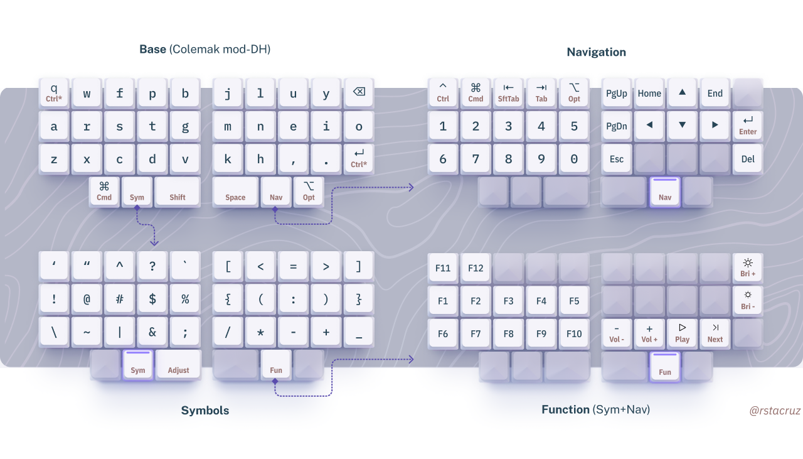

# my zmk config

Builds and flashes zmk firmware via Docker.

```sh
make build        # Build only [alias: make b]
make flash-left   # Build and flash left [alias: make l]
make flash-right  # Build and flash right [alias: make r]
```


